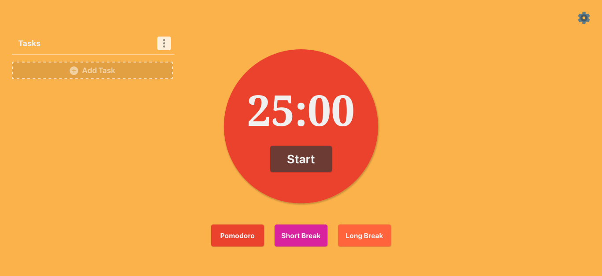
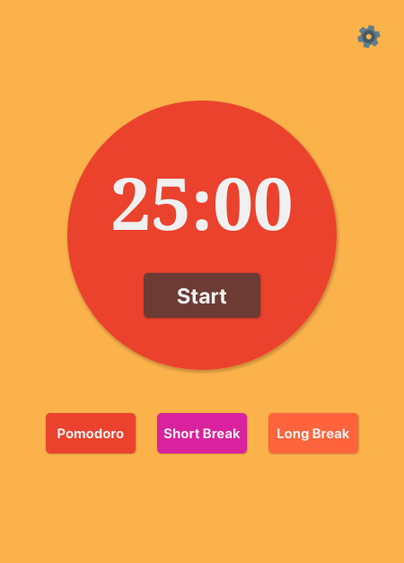

# [Pomodoro Timer]()
Um Pomodoro Timer ultilizado para o gerenciamento de tempo e auxiliar no controle do foco. Construido utilizando Typescript, React(Hooks) e Styled components na estilização.

## Preview

### Desktop

### Mobile

## License
[MIT License](./LICENSE)